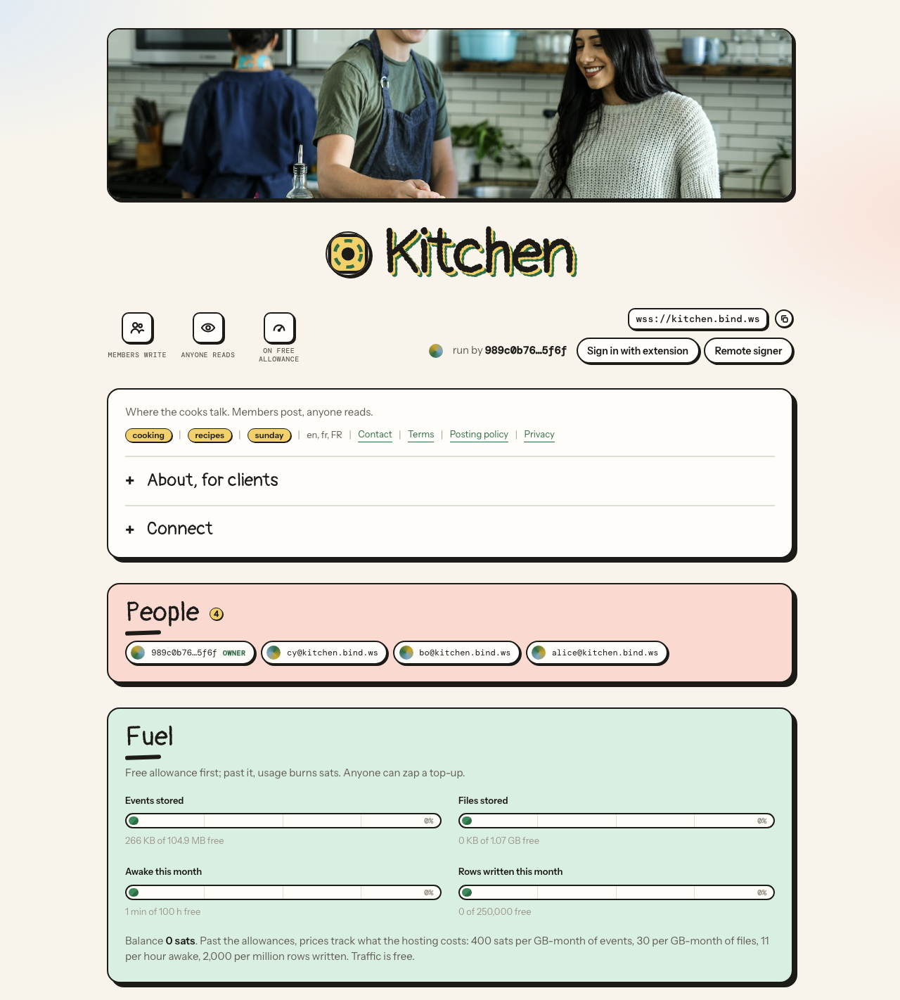
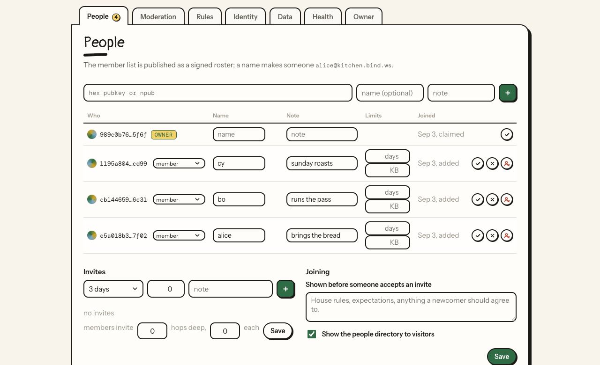

<p align="center"></p>
<p align="center">Relay on demand. Sign once, and it's yours.</p>

Every name under bind.ws is a nostr relay. Claim one with your nostr key, point any client at `wss://<name>.bind.ws` and it's yours. A relay within its fuel allowances owes nothing. Use beyond them is paid with zaps; retained storage and scheduled work still count when nobody is connected.

Not ready to pick a name? Ask for one:

```
curl -X POST https://bind.ws/lease
```

That answers with a relay at a memorable name, open to anyone for 14 days. Claim it before then and it stays, events and all.

<p align="center"></p>

## What a name gives you

- **A relay.** The standard protocol plus search, counts, sync, expiry, deletion, proof of work, a discovery record for relay directories and an HTTP door for scripts. Works with every client. Everything past the core, search, sync, counts, the discovery record, names, files, pages and signer traffic, switches off per relay.
- **A community.** Members, invite links, an invite tree, moderators with a log of what they did, a signed roster and one NIP-29 group per relay, so group-aware clients show it as a place.
- **A site.** Notes and articles as pages with link previews, an Atom feed, and a card with a QR of the group address. NIP-5A also serves root, named and snapshot websites from signed manifests on isolated hostnames, with verified files, optional mirroring and sign-in that follows the relay's read rule.
- **Encrypted group transport.** Opt-in Marmot KeyPackages and opaque MLS group messages, with account admission and storage caps for ephemeral authors. Clients manage encryption and group membership.
- **A Git host.** Opt-in GRASP-01 Smart HTTP, backed by [ntig](https://github.com/FelineStateMachine/ntig). Signed NIP-34 state authorizes branch and tag changes; events wait for their Git objects before publication. Hosting has [explicit storage and transaction limits](docs/22-grasp-01-git-hosting.md#git-http), and the owner can request a bounded read-only inventory without authorizing deletion.
- **A file host.** Blossom and NIP-96 on the same bucket, with mirroring, pre-flight checks and file reports.
- **A console.** Nine tabs on the relay's own page, signed by a browser extension or a remote signer app on a phone. Presets set up an outbox, an inbox, a private relay, a chat, a search replica, a media host or a quiet relay with every costly feature off, in one click. The template collection also includes static sites, public or member-published Marmot transport and Git repositories.
- **A file.** Everything the console sets, as one document with a schema: check it offline, see what applying would change, apply it, pull it back. Keep your relay in your repository. The presets are the same files, in `relay-templates/`.
- **Jobs.** Pull another relay in, keep a standing mirror, fetch your own history from your relay list, rebroadcast to other relays, and dump everything to a file on a schedule.
- **Your own domain.** `wss://relay.example.com` onto your relay with one CNAME, or a custom hostname targeting one of your static sites.
- **Succession.** Name an heir. If your key goes silent, the relay warns you for a month and then hands itself over.

<p align="center"></p>

It runs on Cloudflare Workers with one Durable Object per name, SQLite inside it and R2 beside it. The same code runs without Cloudflare, on [celld](https://celld.dev) with an S3 bucket of your own; that path is checked on demand and [documented](docs/16-hosting-without-cloudflare.md).

Site hosting and mirroring are on by default; Marmot and GRASP are off until enabled. Their storage shares the existing fuel allowances: manifests and messages count as events, while mirrored files and retained Git objects count as files. The Health tab and public `/fuel` endpoint show aggregate usage, prices and balance. Traffic is visible but uncharged; provider operations are not itemized there. See [Understanding fuel](docs/02-understanding-fuel.md) and [Costs and margins](docs/15-costs-and-margins.md).

## Docs

**For users**

- [Getting started](docs/00-getting-started.md): try one, claim a name, connect, invite.
- [Relay configuration](docs/01-relay-configuration.md): the console, tab by tab.
- [Understanding fuel](docs/02-understanding-fuel.md): what is measured, what is free, what a zap buys.
- [People and groups](docs/03-people-and-groups.md): members, invites, moderators, groups, handing over.
- [Data and names](docs/04-data-and-names.md): jobs, dumps, presets, forks, leaving.
- [Your relay on the web](docs/05-your-relay-on-the-web.md): pages, static sites, Git hosting, feed, card, custom domains and media.

**For scripts and agents**

- [Scripts and agents](docs/13-scripts-and-agents.md): a relay end to end with a key and curl, every management method including Git storage inventory, and the relay as a configuration file.
- [HTTP reference](docs/14-http-reference.md): every path, method, auth and answer.

**For developers**

- [Architecture](docs/10-architecture.md): routing, the object, storage, alarm, jobs, identity, groups.
- [Hosting bind.ws](docs/11-hosting-bindws.md): run your own on your own domain, and watch it through logs, traces and metrics.
- [Hosting without Cloudflare](docs/16-hosting-without-cloudflare.md): the same Worker on celld, with your own bucket and proxy, and what "supported" promises.
- [Develop and extend](docs/12-develop-extend.md): layout, tests, adding methods and NIPs, the console, the templates.
- [Costs and margins](docs/15-costs-and-margins.md): application budgets, retained storage, inventory interpretation and deployment margins.

### Draft NIPs

- [NIP-5A static websites](docs/20-nip-5a-static-websites.md): publish and serve static sites from signed Nostr manifests.
- [NIP-AD web addresses](docs/23-nip-ad-web-addresses.md): resolve relay, article and site URLs to their Nostr counterparts.
- [GRASP-01 Git hosting](docs/22-grasp-01-git-hosting.md): host bounded NIP-34 repositories through Git Smart HTTP.
- [NIP-86 membership claims](docs/24-nip86-claims.md): create, list and revoke invitation codes through the standard management methods.
- [NIP-9a relay push](docs/25-nip-9a-relay-push.md): opt-in callback delivery, privacy, bounds and operator setup.
- [NIP-11 identifier compatibility](docs/26-nip11-compatibility.md): lettered capabilities and concrete client parser behavior.
- [List recovery](docs/27-list-recovery.md): privately review and restore older follows, relay lists and bookmarks.

### Protocol guides

- [Marmot transport](docs/21-marmot-transport.md): carry KeyPackages and opaque MLS group messages through a relay.

## Quick start

```
npm install
npm run dev      # http://<name>.localhost:8787
npm test
npm run typecheck  # types, generated files, the configs, every template
npm run deploy
```

## Protocol surface

NIP-01, 05, 09, 11, 13, 17, 29, 40, 42, 43, 45, 46 transport, 50, 56, 57, 59, 62, 66, 67, 70, 77, 86, 94, 96, 98, Marmot transport and Blossom BUD-01, 02, 04, 06, 08, 09. A relay's information document lists what its owner left on.

NIP-5A site discovery uses the `nsites` field. GRASP advertises `supported_grasps: ["GRASP-01"]` only while enabled with open reads. Later GRASP specifications and server-side MLS group management are outside this implementation.

## License

MIT
