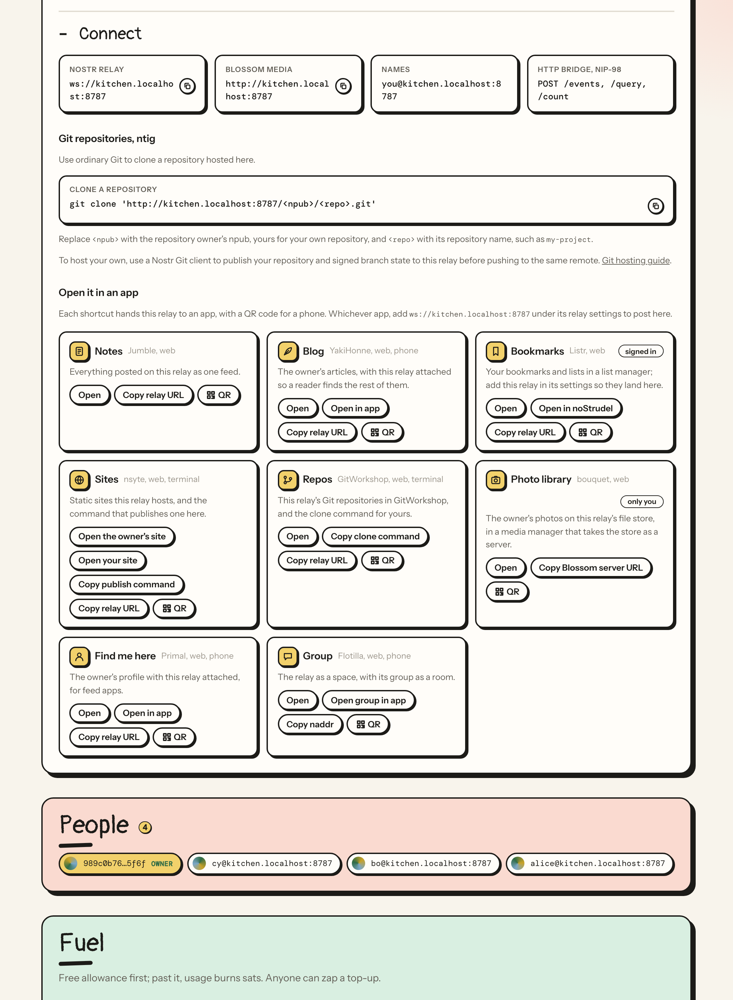
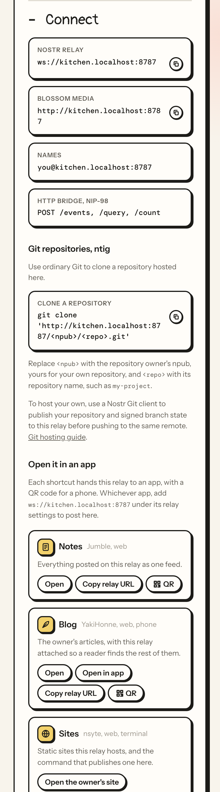

# Connection templates

A connection template is one app shortcut for a relay's Connect fold: which app opens, what it does with this relay, and the links that hand a viewer over to it. The links are written once, with placeholders, and the relay fills them in for whoever is looking, so one good template works on any relay and every client sees the same handoff. The library is `connection-templates/`, one file per shortcut, folded into `src/gen/connections.ts`; `src/connections.ts` parses, resolves and serves it. The owner picks from the library on the console's Connect tab: which shortcuts show, in what order, and who sees each. A relay template in `relay-templates/` can name shortcuts too, so one preset sets the rules and the handoffs that go with them.

The catalog, one row per template on when to choose it, is the folder's README, [Connection templates](../connection-templates/README.md). The seed library is `notes` (the relay as a feed in Jumble), `find-me` (the owner's profile with this relay attached, in Primal or the viewer's own app through a `nostr:` link), `group` (the relay's group in Flotilla), `blog` (the owner's articles in YakiHonne), `repos` (GitWorkshop, needs GRASP, with one input, the repository name, for a clone command that names the viewer), `sites` (needs sites: the owner's root site and the viewer's own at `https://<npub>.<domain>`, and an nsyte publish command), `bookmarks` (Listr, for signed-in viewers), `photos` (bouquet, the owner's alone by default, needs files), `files` (bouquet, members, needs files), `dm` (the owner in 0xchat), `marmot` (White Noise, needs Marmot) and `relay-page` (Coracle).

## The file

A template is a JSON document, comments and trailing commas allowed, whose `$schema` names `https://bind.ws/connection-template.schema.json`, the same file as `connection-template.schema.json` at the repository root and served at the apex. The schema is for the editor; `parseConnectionTemplate` in `src/connections.ts` is the last word, and the build runs both. The file's name is a number and the template's name: `03-group.jsonc` is `group` in an owner's list, and the number is the order the library shows them in.

| Field | Required | Value |
|---|---|---|
| `format` | yes | `bind.ws/connection-template/1` |
| `title` | yes | what the shortcut is for, in the owner's words, up to 40 characters: Notes, Repos, Photo library |
| `about` | yes | one sentence on what opens and what it does with this relay, up to 200 characters |
| `app` | yes | the app the shortcut hands over to, up to 40 characters |
| `where` | no | where the app runs, up to 40 characters: web, phone, iPhone, Android, desktop, terminal |
| `icon` | no | one of the console's icons: `notes`, `blog`, `bookmark`, `photo`, `site`, `git`, `chat`, `person`, `files`, `key`, `search`, `feed`, `lock`, `app`; `app` when left out |
| `feature` | no | one of `search`, `sync`, `count`, `discovery`, `names`, `files`, `pages`, `signer`, `sites`, `marmot`, `grasp`, `push`; the shortcut is shown only while that feature is on |
| `visibility` | no | `public`, `auth`, `members` or `owner`: who sees the shortcut when the owner adds it without saying; `public` when left out |
| `links` | yes | 1 to 6, each a `label` (up to 40 characters) with either an `href` to open (`https://` or `nostr:`) or a `copy` text for the clipboard, up to 2,000 characters |
| `qr` | no | what the QR code carries, up to 2,000 characters; when left out, the first link's `href`, or the first link's `copy` text when no link has one |
| `inputs` | no | up to 4, each a `name` (a lowercase letter, then up to 23 lowercase letters, digits, dashes or underscores), a `label` (up to 60 characters), an optional `placeholder` (200) and an optional `default` (500); the owner fills them when adding the shortcut and a link names one as `{input:name}` |

The group template, as it is in the repository:

```jsonc
{
  "$schema": "https://bind.ws/connection-template.schema.json",
  "format": "bind.ws/connection-template/1",
  "title": "Group",
  "about": "The relay as a space, with its group as a room.",
  "app": "Flotilla",
  "where": "web, phone",
  "icon": "chat",
  "visibility": "public",
  "links": [
    { "label": "Open", "href": "https://app.flotilla.social/spaces/{relay:host|enc}" },
    { "label": "Open group in app", "href": "nostr:{relay:naddr}" },
    { "label": "Copy naddr", "copy": "{relay:naddr}" }
  ],
  "qr": "nostr:{relay:naddr}"
}
```

## Placeholders

Links, copy texts and the QR text carry placeholders of the form `{source:field}`. `PLACEHOLDER_FIELDS` in `src/connections.ts` is the vocabulary.

| Placeholder | Fills in |
|---|---|
| `{relay:url}` | the relay's websocket address, `wss://<name>.bind.ws`, from the host the request came in on, so a custom domain fills in its own |
| `{relay:host}` | that host, `<name>.bind.ws` |
| `{relay:web}` | the same address for a browser, `https://<name>.bind.ws` |
| `{relay:name}` | the relay's name, `<name>` |
| `{relay:domain}` | the domain the relay runs under, `bind.ws`, where NIP-5A sites live |
| `{relay:hex}`, `{relay:npub}`, `{relay:nprofile}` | the relay's own key, the nprofile with this relay as the hint |
| `{relay:naddr}` | the group address: kind 39000, the relay's key, the relay's name, this relay as the hint |
| `{owner:hex}`, `{owner:npub}`, `{owner:nprofile}` | the owner, the nprofile with this relay as the hint |
| `{user:hex}`, `{user:npub}`, `{user:nprofile}` | whoever is signed in and looking |
| `{input:<name>}` | what the owner typed into the template's input of that name, or the input's default |

A `|enc` suffix, as in `{relay:url|enc}`, percent-encodes the value for a query string.

A link that names a `{user:*}` value is left out for a visitor, and the shortcut says `needsUser` so the fold can ask for a sign-in. A value the relay does not have yet, the owner of an unclaimed relay or the relay's own key before it has an identity, drops the link rather than showing it broken. A template that names a field outside this table, or an `{input:*}` it does not declare, fails the build. An owner's input cannot smuggle another scheme in: a resolved link is shown only while it is still a web or `nostr:` link. A template's `href` must start with `https://` or `nostr:`; plain `http://` is admitted after resolution only, since `{relay:web}` resolves to it on a local dev host.

## Visibility

| Visibility | Who sees the shortcut |
|---|---|
| `public` | anyone |
| `auth` | anyone signed in |
| `members` | members and the owner |
| `owner` | the owner |

Visibility is judged from the key the asker proved with a NIP-98 signature (`visibleTo` in `src/connections.ts`). A template sets the visibility a shortcut starts with; the owner changes it per shortcut.

## The owner's list

The list is kept in settings as the ordered list the fold shows, and is the `connections` section of the configuration document, at the top level beside `kinds` and `retention`. Each entry names a template and may say who sees it, replace its words and fill its inputs. At most 24 entries, in the order shown.

| Field | Value |
|---|---|
| `template` | a file in `connection-templates/`, by name: `notes` for `01-notes.jsonc` |
| `visibility` | `public`, `auth`, `members` or `owner`; the template's own when left out |
| `title` | the owner's title instead of the template's, up to 40 characters |
| `about` | the owner's sentence instead of the template's, up to 200 characters |
| `inputs` | the template's inputs by name, each a string up to 500 characters; a blank one takes the template's default |

```jsonc
"connections": [
  { "template": "notes" },
  { "template": "repos", "inputs": { "repo": "bindws" } },
  { "template": "photos", "visibility": "owner", "title": "Photo library" }
]
```

Until the owner saves a list, the relay shows the defaults (`DEFAULT_CONNECTIONS` in `src/settings.ts`): `notes`, `find-me` and `group`, all public. A saved list replaces them, and a saved empty list shows nothing. `parseConnections` checks entries against the library when they are written, and `resolveConnections` checks again when the fold asks, so a template that left the library is skipped rather than shown broken.

## How the fold shows them

`resolveConnections` in `src/connections.ts` is the owner's list as one viewer sees it. For each entry, in order:

1. The template is in the library, or the entry is skipped.
2. The template's `feature`, when it names one, is on, or the shortcut is skipped.
3. The shortcut's visibility admits the viewer.
4. Each input takes the owner's value, or the template's default.
5. Each link is filled in. A link with a value the relay cannot fill is left out; when the missing value is a `{user:*}` one, the shortcut says `needsUser`.
6. A shortcut with no links left and nothing waiting on a sign-in is not shown.
7. The QR text is filled in; it is `""` when a value is missing or the text is over 512 bytes, the QR encoder's limit.
8. The title and the sentence are the owner's when the entry set them, else the template's.

`GET /connect.json` is that list for whoever asks (`connectDoor`). The NIP-98 signature is optional: without one the asker is a visitor, with one the door answers for that key. A signature that does not verify answers 401 with the reason rather than a visitor's view, so a client that tried to sign learns what went wrong. The unsigned answer carries `cache-control: public, max-age=60`, the signed one `no-store`, and both allow any origin.

```json
{
  "relay": { "url": "wss://name.bind.ws", "host": "name.bind.ws", "web": "https://name.bind.ws", "name": "name" },
  "viewer": "<the signer's hex pubkey, or null>",
  "connections": [
    {
      "template": "group", "title": "Group", "about": "The relay as a space, with its group as a room.",
      "app": "Flotilla", "where": "web, phone", "icon": "chat", "visibility": "public",
      "links": [{ "label": "Open", "href": "https://app.flotilla.social/spaces/name.bind.ws" }, { "label": "Open group in app", "href": "nostr:naddr1..." }, { "label": "Copy naddr", "copy": "naddr1..." }],
      "qr": "nostr:naddr1...", "needsUser": false
    }
  ]
}
```

The Connect fold on the relay's page is a client of this door. It shows the shortcuts as tiles: the icon, the title, the app and where it runs, the sentence, one button per link (Open, Open in app, Copy ...), and a QR button that reveals a QR code of the handoff link for a phone. A visitor sees the public shortcuts; signing in reveals the rest the viewer may see and fills the links that need the viewer's own key.

The owner's console has a Connect tab, between Identity and Data. **Shortcuts** is the current list as rows: a title override, a visibility selector, the template's inputs, move up and down, remove, and Save, which sends the whole list. **Library** is one card per template with Add; a template whose feature is off says so.

The fold as the owner sees it on a relay with the `home` preset applied, at a desktop width and at a phone width:





## Management methods

Three NIP-86 methods in `METHODS` (`src/manage.ts`), called like every other ([Scripts and agents](13-scripts-and-agents.md#management-calls-nip-86)):

| Method | Action | Answers |
|---|---|---|
| `listconnectiontemplates` | read | the library, each template with its fields and `available`: whether the feature it needs is on, `true` when it needs none |
| `listconnections` | read | the owner's list as saved, or the defaults |
| `setconnections list` | rules, the owner's | replaces the whole list in the order given and answers it; 400 with the reason when an entry names no template, a visibility that is not one of the four, an input the template lacks, or the list runs past 24. The console builds the list from the library, so a bad entry is a mistake to report, not to drop |

`listpresets` entries carry `connections` when the template has them, so the console can say what a preset sets.

## The configuration document

`connections` is a section like `kinds` and `retention` ([Scripts and agents](13-scripts-and-agents.md#the-configuration-file)): `exportconfig` includes it, `importconfig` applies it, and a document that leaves it out leaves the shortcuts alone. `parseConfig` drops an entry no relay would take, one warning each: `connections[2]: no connection template named blog`, `connections[0].inputs.repo: notes has no such input`, `connections[24]: at most 24 connections`. `npm run relay check` prints the section as `connections: notes, photos (owner)`.

A dry run summarizes the section in one line. A shortcut is the whole of its entry, so the same template with another visibility or input is one removed and one added: `connections: +repos, -sites (members)`. A list with the same entries in another order says `connections: reordered`.

## Relay templates

A relay template in `relay-templates/` may carry a `connections` section in the same shape. Applying the preset then sets the shortcuts with the rules; a template without the section leaves the shortcuts as they are, the way Default leaves the feature settings alone. The seed templates:

| Template | Shortcuts |
|---|---|
| default | left alone |
| outbox | notes, find-me, blog |
| inbox | find-me, notes |
| chat | group |
| media | files, photos |
| search | notes |
| articles | blog, notes |
| dm | dm |
| quiet | none: an empty list |
| site | sites, notes |
| marmot, marmot-members | marmot |
| grasp | repos, notes |
| home | notes, blog, bookmarks, sites, repos, a private photo library, find-me and group |

`home` (`15-home.jsonc`) is the one-name relay: members write, anyone reads, sites, files and Git on, with a shortcut for each.

## Build and checks

`npm run build:connections` folds `connection-templates/*.jsonc` into `src/gen/connections.ts`, in file order, with each file's `$schema` dropped; the generated file is committed. `npm run typecheck` runs three checks on the folder:

| Check | Script | Fails when |
|---|---|---|
| the generated module | `scripts/build/build-connections.mjs --check` | `src/gen/connections.ts` is stale |
| the catalog | the same script, in either mode | `connection-templates/README.md` has no row linking the file |
| every file | `scripts/check/check-connections.mjs` | a file fails the schema, or the relay's own parser: a placeholder outside the vocabulary, an `{input:*}` the file does not declare, a link with both an `href` and a `copy` or neither, a scheme other than `https://` or `nostr:` |

The parser check bundles `src/connections.ts` with esbuild and runs `parseConnectionTemplate` itself, so the file that fails here is the file that would have failed the fold.

## Add a connection template

1. Write `connection-templates/NN-name.jsonc`, the next number and the name the owner's list will use. Put `$schema` first, so the editor checks it, and a comment above the document saying what the template is for and why its links are what they are. A link that only makes sense for a signed-in viewer names `{user:*}`; a shortcut that only makes sense with a feature on names it in `feature`; something the owner has to supply, such as a repository name, is an `input`.
2. Add a row to the table in `connection-templates/README.md`, linking the file and saying when to choose it.
3. `npm run build:connections`.
4. `npm run typecheck`.
5. Try it: `npm run dev`, then `npm run dev:signer`, open `http://<name>.localhost:8787/`, sign in as the owner, and on the Connect tab add the template from the Library and Save. The Connect fold on the relay's page shows the tile, and `curl http://<name>.localhost:8787/connect.json` shows the links as a visitor gets them.
6. Commit the file, the README row and `src/gen/connections.ts` together, so the commit typechecks on its own.
